Data Analysis
================
Jerrod Abee
3/9/2022

## Introduction

Personally, having played football for more than a decade, coaches have
often harped the importance of discipline and how that directly
influences team success. This discipline can be translated to penalties
on the football field, and not turning the ball over to the other team.
This claim has been proven to an extent on betting firm’s article
discussing how important Turnovers and Turnover differentials are in the
winning of football games1. Even the number of increased penalties in
recent years has affected win rates of teams, and psychological impacts
to players and coaches2. With the increase in data analytics for
football, new values have been introduced that have shown more accuracy
in predicting wins. Two of the variables that I look at in this study
are average points per drive and forced turnovers. The average points
per drive metric has shown to be an increasingly accurate predictor of
the success of teams3. With the main objective in the NFL being a
Superbowl Title, to enter the tournament to play for the Superbowl you
need to first make the playoffs. So in the second part of this study, I
look at playoff teams and whether or not you can predict if a team will
make the playoffs based on the variables looked at in this study. Also,
I will be looking at if penalties, turnovers, points per drive, and
forced turnovers have a significant impact on the number of regular
season games won in the NFL from the years 1999-2019.

I am pulling my data from
<https://www.kaggle.com/ttalbitt/american-football-team-stats-1998-2019>

``` r
rawDataAll <- read_csv("AmericanFootball98.csv")
```

    ## New names:
    ## * `` -> ...18

    ## Rows: 669 Columns: 63
    ## -- Column specification --------------------------------------------------------
    ## Delimiter: ","
    ## chr   (3): team_code, avg start, opp avg start
    ## dbl  (58): wins, losses, PF, yards, plays, yards/play, TO, Fumbles Lost, 1st...
    ## time  (2): avg time per drive, opp avg time per drive
    ## 
    ## i Use `spec()` to retrieve the full column specification for this data.
    ## i Specify the column types or set `show_col_types = FALSE` to quiet this message.

## Data Cleaning

First I will be cleaning and organizing the data set into something easy
for me to read. First by renaming variables then pulling it into a
subset I call rawDataTesting, and I will then separate the team name and
the year each team competed.

``` r
rawDataAll$avgPPD <- rawDataAll$`avg points per drive`
rawDataAll$oppTO <- rawDataAll$`opp TO`
rawDataTesting <- select(rawDataAll, team_code, avgPPD, oppTO, penalties, TO, wins)

rawDataTesting <- separate(rawDataTesting,team_code, into = c("teamName","year"),"(?<=[a-z])(?=[0-9])")
```

Then I organize the team names into easier to read by using the full
name not the abbreviations.

``` r
rawDataTesting$teamName <- rawDataTesting$teamName %>%
  stringr::str_replace("rai", "Raiders") %>%
  stringr::str_replace("ram", "Rams") %>%
  stringr::str_replace("rav", "Ravens") %>% 
  stringr::str_replace("det", "Lions") %>%
  stringr::str_replace("dal", "Cowboys") %>%
  stringr::str_replace("phi", "Eagles") %>%
  stringr::str_replace("sfo", "49ers") %>%
  stringr::str_replace("tam", "Bucaneers") %>%
  stringr::str_replace("oti", "Titans") %>%
  stringr::str_replace("buf", "Bills") %>%
  stringr::str_replace("was", "Football Team") %>%
  stringr::str_replace("min", "Vikings") %>%
  stringr::str_replace("nor", "Saints") %>%
  stringr::str_replace("crd", "Cardinals") %>%
  stringr::str_replace("htx", "Texans") %>%
  stringr::str_replace("sdg", "Chargers") %>%
  stringr::str_replace("sea", "Seahawks") %>%
  stringr::str_replace("den", "Broncos") %>%
  stringr::str_replace("cle", "Browns") %>%
  stringr::str_replace("cin", "Bengals") %>%
  stringr::str_replace("mia", "Dolphins") %>%
  stringr::str_replace("chi", "Bears") %>%
  stringr::str_replace("nyg", "Giants") %>%
  stringr::str_replace("kan", "Chiefs") %>%
  stringr::str_replace("jax", "Jaguars") %>%
  stringr::str_replace("gnb", "Packers") %>%
  stringr::str_replace("car", "Panthers") %>%
  stringr::str_replace("pit", "Steelers") %>%
  stringr::str_replace("atl", "Falcons") %>%
  stringr::str_replace("nwe", "Patriots") %>%
  stringr::str_replace("nyj", "Jets") %>%
  stringr::str_replace("clt", "Colts")
```

Next I will begin to find the 3 teams that have won the most games, and
the 3 teams that have won the least amount of games on average per year.
The 3 most winning teams on average will be labeled with green bars, and
the 3 least winning teams will be labeled with red bars.

``` r
windataTesting <- rawDataTesting %>%
  group_by(teamName) %>%
  summarize(percentWins = mean(wins)) %>%
  transform(teamName = reorder(teamName, -percentWins)) %>%
  ggplot () + 
    aes(x=teamName, y=percentWins, fill = teamName) + 
    ggtitle("Average Wins per Year by Teams in 1999-2019") +
    scale_fill_manual(name = "Legend",
                      label = c("Top 3 in Avg Wins","Bottom 3 in Avg Wins", "Other"),
                      values = c("Patriots" = "green", "Steelers" = "green","Colts" = "green","Browns" = "red","Lions" = "red","Raiders" = "red","Packers" = "black","Ravens" = "black","Eagles" = "black","Seahawks" = "black","Broncos" = "black","Saints" = "black","Cowboys" = "black","Chiefs" = "black","Vikings" = "black", "Titans" = "black","Chargers" = "black","Falcons" = "black","Giants" = "black","Panthers" = "black","Bears" = "black","Dolphins" = "black","Rams" = "black","Jets" = "black","Texans" = "black","49ers" = "black","Bengals" = "black","Bucaneers" = "black","Bills" = "black","Cardinals" = "black","Football Team" = "black","Jaguars" = "black")) +
    theme(axis.text.x = element_text(angle = 30, hjust = 1),
          text=element_text(size=10, face="bold"),
          legend.position = "none") +
    labs(y="Average Wins per Year", x = "Team") +
    geom_col()
windataTesting
```

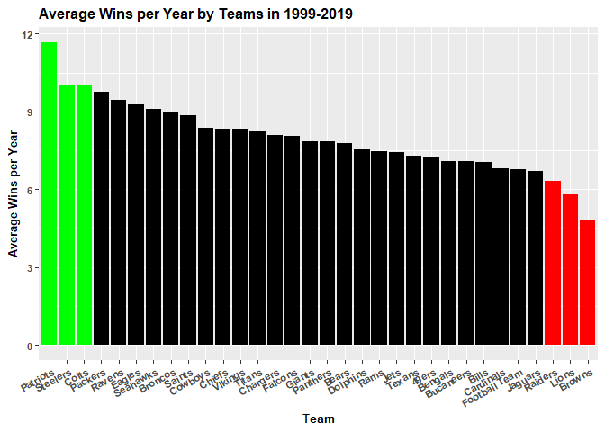

<center>
*Figure 1*
</center>

So from now on, the Patriots, Steelers, and Colts will be labeled in
green, and the Raiders, Lions, and Browns will be labeled in Red.

### **Penalty Visualization**

Now I will generate a chart be each teams average number of penalties
over the timeframe denoted in the data set.

``` r
penaltydataTesting <- rawDataTesting %>%
  group_by(teamName) %>%
  summarize(percentPenalties = mean(penalties)) %>%
  transform(teamName = reorder(teamName, -percentPenalties)) %>%
  ggplot () + 
    aes(x=teamName, y=percentPenalties, fill = teamName) + 
    ggtitle("Average Penalties per Year by Teams in 1999-2019") +
    scale_fill_manual(name = "Legend",
                      label = c("Top 3 in Avg Wins","Bottom 3 in Avg Wins", "Other"),
                      values = c("Patriots" = "green", "Steelers" = "green","Colts" = "green","Browns" = "red","Lions" = "red","Raiders" = "red","Packers" = "black","Ravens" = "black","Eagles" = "black","Seahawks" = "black","Broncos" = "black","Saints" = "black","Cowboys" = "black","Chiefs" = "black","Vikings" = "black", "Titans" = "black","Chargers" = "black","Falcons" = "black","Giants" = "black","Panthers" = "black","Bears" = "black","Dolphins" = "black","Rams" = "black","Jets" = "black","Texans" = "black","49ers" = "black","Bengals" = "black","Bucaneers" = "black","Bills" = "black","Cardinals" = "black","Football Team" = "black","Jaguars" = "black")) +
    theme(axis.text.x = element_text(angle = 30, hjust = 1),
          text=element_text(size=10, face="bold"),
          legend.position = "none") +
    labs(y="Average Penalties per Year", x = "Team") +
    geom_col()
penaltydataTesting
```

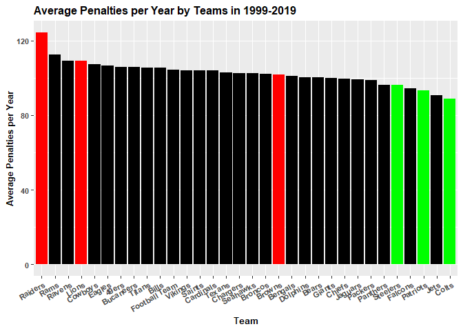
<center>
*Figure 2*
</center>

This chart furthers the claim that the teams that win more games are not
as heavily penalized as the teams that are penalized more.

Now I will generate a chart be each teams average number of penalities
over the timeframe denoted in the data set.

``` r
pointsdataTesting <- rawDataTesting %>%
  group_by(teamName) %>%
  summarize(percentPoints = mean(avgPPD)) %>%
  transform(teamName = reorder(teamName, -percentPoints)) %>%
  ggplot () + 
    aes(x=teamName, y=percentPoints, fill = teamName) + 
    ggtitle("Average Points Per Drive per Year by Teams in 1999-2019") +
      scale_fill_manual(name = "Legend",
                        label = c("Top 3 in Avg Wins","Bottom 3 in Avg Wins", "Other"),
                        values = c("Patriots" = "green", "Steelers" = "green","Colts" = "green","Browns" = "red","Lions" = "red","Raiders" = "red","Packers" = "black","Ravens" = "black","Eagles" = "black","Seahawks" = "black","Broncos" = "black","Saints" = "black","Cowboys" = "black","Chiefs" = "black","Vikings" = "black", "Titans" = "black","Chargers" = "black","Falcons" = "black","Giants" = "black","Panthers" = "black","Bears" = "black","Dolphins" = "black","Rams" = "black","Jets" = "black","Texans" = "black","49ers" = "black","Bengals" = "black","Bucaneers" = "black","Bills" = "black","Cardinals" = "black","Football Team" = "black","Jaguars" = "black")) +
      theme(axis.text.x = element_text(angle = 30, hjust = 1),
            text=element_text(size=10, face="bold"),
            legend.position = "none") +
      labs(y="Average Points Per Drive per Year", x = "Team") +
      geom_col()
pointsdataTesting
```

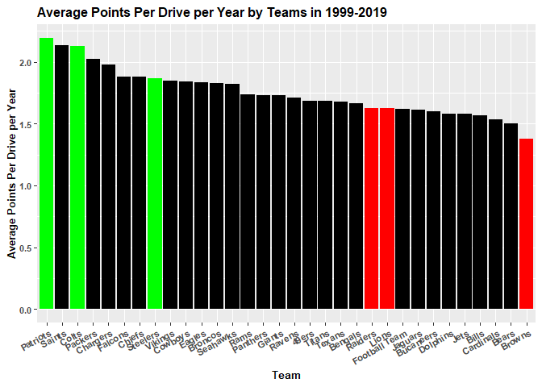
<center>
*Figure 3*
</center>

### **Average Turnovers Visualization**

This chart represents the average turnovers per year by each team. As we
can see, the 3 worst teams in the average win category, have all higher
average turnovers than the 3 best teams in the winning category,
supporting the claim that the NFL teams that win more games, turn the
ball over the least amount of times.

``` r
avgtodataTesting <- rawDataTesting %>%
  group_by(teamName) %>%
  summarize(percentTO = mean(TO)) %>%
  transform(teamName = reorder(teamName, -percentTO)) %>%
  ggplot () + 
    aes(x=teamName, y=percentTO, fill = teamName) + 
    ggtitle("Average Turn Overs per Year by Teams in 1999-2019") +
    scale_fill_manual(name = "Legend",
                      label = c("Top 3 in Avg Wins","Bottom 3 in Avg Wins", "Other"),
                      values = c("Patriots" = "green", "Steelers" = "green","Colts" = "green","Browns" = "red","Lions" = "red","Raiders" = "red","Packers" = "black","Ravens" = "black","Eagles" = "black","Seahawks" = "black","Broncos" = "black","Saints" = "black","Cowboys" = "black","Chiefs" = "black","Vikings" = "black", "Titans" = "black","Chargers" = "black","Falcons" = "black","Giants" = "black","Panthers" = "black","Bears" = "black","Dolphins" = "black","Rams" = "black","Jets" = "black","Texans" = "black","49ers" = "black","Bengals" = "black","Bucaneers" = "black","Bills" = "black","Cardinals" = "black","Football Team" = "black","Jaguars" = "black")) +
    theme(axis.text.x = element_text(angle = 30, hjust = 1),
          text=element_text(size=10, face="bold"), legend.position = "none") +
    labs(y="Average Turn Overs per Year", x = "Team") +
    geom_col()
avgtodataTesting
```

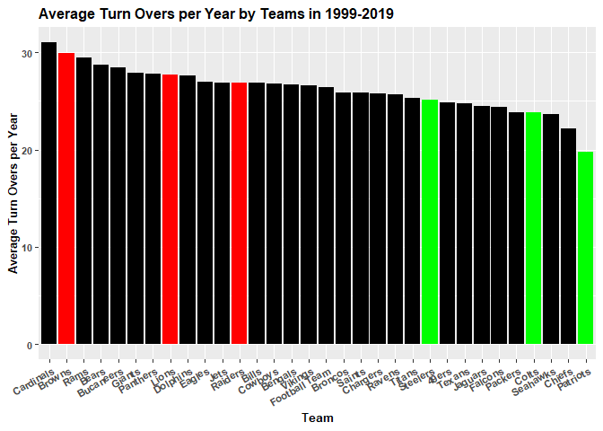
<center>
*Figure 4*
</center>

### **Average Forced Turnovers Visualization**

This graph represents the forced turnovers by each team in the 20 year
period and furthers the claim that the teams that win more, their
defenses cause more turnovers than teams who do not win as much. This
graph also shows the most variance in the number of winning claims, but
further studying shows that this is actually one of the most important
variables in determining the number of wins per season, not just the
average wins over 20 years.

``` r
forcedTOdataTesting <- rawDataTesting %>%
  group_by(teamName) %>%
  summarize(percentFTO = mean(oppTO)) %>%
  transform(teamName = reorder(teamName, -percentFTO)) %>%
  ggplot () + 
    aes(x=teamName, y=percentFTO, fill = teamName) + 
    ggtitle("Average Forced Turn Overs per Year by Teams in 1999-2019") +
    scale_fill_manual(name = "Legend",
                      label = c("Top 3 in Avg Wins","Bottom 3 in Avg Wins", "Other"),
                      values = c("Patriots" = "green", "Steelers" = "green","Colts" = "green","Browns" = "red","Lions" = "red","Raiders" = "red","Packers" = "black","Ravens" = "black","Eagles" = "black","Seahawks" = "black","Broncos" = "black","Saints" = "black","Cowboys" = "black","Chiefs" = "black","Vikings" = "black", "Titans" = "black","Chargers" = "black","Falcons" = "black","Giants" = "black","Panthers" = "black","Bears" = "black","Dolphins" = "black","Rams" = "black","Jets" = "black","Texans" = "black","49ers" = "black","Bengals" = "black","Bucaneers" = "black","Bills" = "black","Cardinals" = "black","Football Team" = "black","Jaguars" = "black")) +
    theme(axis.text.x = element_text(angle = 30, hjust = 1),
          text=element_text(size=10, face="bold"),
          legend.position = "none") +
    labs(y="Average Forced Turn Overs per Year", x = "Team") +
    geom_col()
forcedTOdataTesting
```

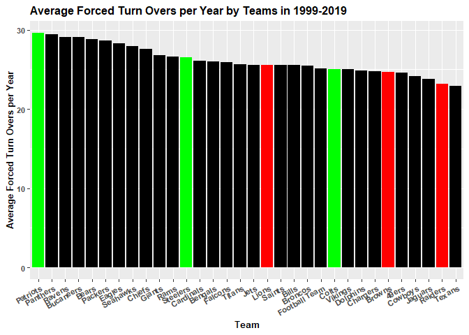
<center>
*Figure 5*
</center>

## Method of Analysis - Linear Modeling

To first determine the predictive analytics involved with predicting the
number of wins, I decided to run a K-Fold linear model. This model was
run based on number of penalties, turn overs, average points per drive,
and forced turnovers. I then build scatterplots with regression lines to
determine the pattern that would occur to overall increase the number of
wins in a season. The K-Fold model build ran with ten sections of
analysis, repeated 3 times to get the overall model. The model had an
adjusted R score of 0.6437 with a correlation of 0.5839. It was found
that the only variable looked at that did not have significance was
number of penalties. Although it had a negative association with number
of wins, it was not statistically significant.

``` r
trctrl <- trainControl(method = "repeatedcv",number = 10, repeats = 3)
lmOut <- train(wins ~ avgPPD + oppTO + penalties + TO, 
               data=rawDataTesting,
               trControl = trctrl,
               method = "lm")
summary(lmOut)
```

    ## 
    ## Call:
    ## lm(formula = .outcome ~ ., data = dat)
    ## 
    ## Residuals:
    ##     Min      1Q  Median      3Q     Max 
    ## -6.0735 -1.2668 -0.0491  1.2846  5.7903 
    ## 
    ## Coefficients:
    ##              Estimate Std. Error t value Pr(>|t|)    
    ## (Intercept)  0.283315   0.812104   0.349  0.72730    
    ## avgPPD       3.944148   0.213951  18.435  < 2e-16 ***
    ## oppTO        0.171202   0.010825  15.816  < 2e-16 ***
    ## penalties   -0.011538   0.004464  -2.585  0.00996 ** 
    ## TO          -0.096218   0.012267  -7.844 1.75e-14 ***
    ## ---
    ## Signif. codes:  0 '***' 0.001 '**' 0.01 '*' 0.05 '.' 0.1 ' ' 1
    ## 
    ## Residual standard error: 1.885 on 664 degrees of freedom
    ## Multiple R-squared:  0.6271, Adjusted R-squared:  0.6249 
    ## F-statistic: 279.2 on 4 and 664 DF,  p-value: < 2.2e-16

We can see that there is a strong correlation between a higher avg PPD,
opp TO, rather than penalties and Turnovers. Still, all 4 generate a
strong correlation that I will now visualize with bivatriate scatter
plots:

### **Average Points Per Drive**

``` r
rawDataTesting %>%
ggplot() + aes(x=avgPPD, y = wins) + 
  ggtitle("Average Points Per Drive by Teams in 1999-2019") +
  geom_point()+ 
  labs(y="Number of Wins", x = "Average Points Per Drive by Team") +
  geom_smooth(method = "lm")
```

    ## `geom_smooth()` using formula 'y ~ x'

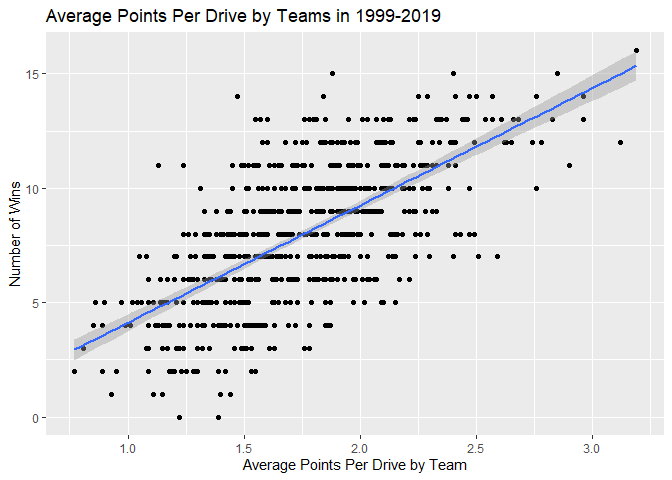
<center>
*Figure 6*
</center>

This is the scatterplot of average points per drive by teams, and the
number of games won in the regular season. With a coefficient of 4.124,
and a p-value of 2e-16, we can assume that this variable holds a
statistical significance when trying to predict the number of wins in
the season.

### **Forced Turnovers**

``` r
rawDataTesting %>%
  ggplot() + aes(x=oppTO, y = wins) +
  ggtitle("Number of Forced Turn Overs by Teams in 1999-2019") +
  geom_point()+ 
  labs(y="Number of Wins", x = "Number of Forced Turn Overs by Team") +
  geom_smooth(method = "lm")
```

    ## `geom_smooth()` using formula 'y ~ x'

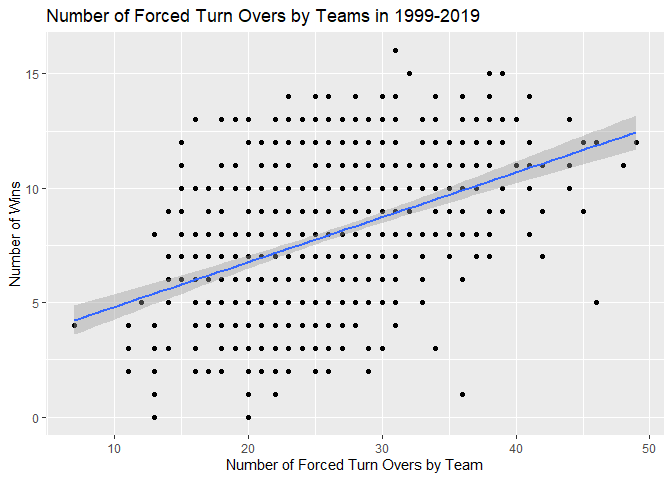
<center>
*Figure 7*
</center>

This is the scatterplot showing the number of turnovers forced in a
season and the number of games won by that team. With a coefficient of
0.1658 and a p-value of 2e-16, this is also a statistically significant
variable in the prediction model of the number of wins in a football
season.

### **Turnovers**

``` r
rawDataTesting %>%
  ggplot() + aes(x=TO, y = wins) +
  ggtitle("Number of Turn Overs by Teams in 1999-2019") +
  labs(y="Number of Wins", x = "Number of TurnOvers by Team") +
  geom_point()+ 
  geom_smooth(method = "lm")
```

    ## `geom_smooth()` using formula 'y ~ x'

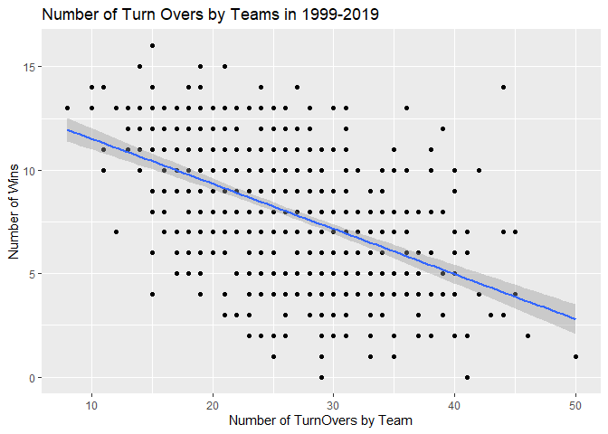
<center>
*Figure 8*
</center>

This is the scatterplot showing the number of turn overs by a team and
the number of wins they had that season. With a coefficient of -0.098,
and a p-value of 8.77e-11, we can assume that this variable holds
statistical significance when predicting the number of wins in the
football season.

### **Penalties**

``` r
rawDataTesting %>%
  ggplot() + aes(x=penalties, y = wins) +
  ggtitle("Number of Penalties by Teams in 1999-2019") +
  labs(y="Number of Wins", x = "Number of Penalties by Team") +
  geom_point()+ 
  geom_smooth(method = "lm")
```

    ## `geom_smooth()` using formula 'y ~ x'

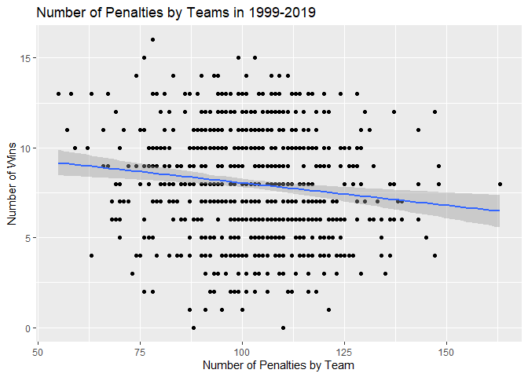
<center>
*Figure 9*
</center>

This is the scatter plot showing the correlation of penalties in a
season and the number of wins. With a coefficient of -0.0059 and a
p-value of 0.261, this variable is not statistically significant when
trying to predict the number of wins in a season.

Now I will try to assign the continuous variables into bins to see if
there are definable levels to success with these different predictors.

I will re-code turnovers into sets of 5, and then make a bar chart
visualization to see the distribution.

``` r
rawDataTesting$roundedTO <- RoundTo(rawDataTesting$TO, 5)

rawDataTesting %>%
  group_by(roundedTO) %>%
  summarize (wins = mean(wins)) %>%
  ggplot() + aes(x=roundedTO, y=wins) + geom_col() + ggtitle("Number of Turnovers by Teams in Increments of 5")
```


<center>
*Figure 10*
</center>

Now I will chart Points Per Drive in intervals of 0.5, to see if this is
a better predictor than the linear model.

``` r
rawDataTesting$roundedPPD <- RoundTo(rawDataTesting$avgPPD, 0.5)

rawDataTesting %>%
  group_by(roundedPPD) %>%
  summarize (wins = mean(wins)) %>%
  ggplot() + aes(x=roundedPPD, y=wins) + geom_col() + ggtitle("Number of Points Per Drive by Teams in Increments of 0.50")
```

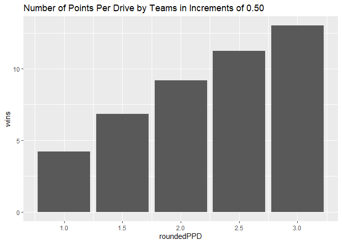
<center>
*Figure 11*
</center>

This will chart forced turnovers in intervals of 5, to see if this
method is a better predictor than the linear model.

``` r
rawDataTesting$roundedOppTO <- RoundTo(rawDataTesting$oppTO, 5)

rawDataTesting %>%
  group_by(roundedOppTO) %>%
  summarize (wins = mean(wins)) %>%
  ggplot() + aes(x=roundedOppTO, y=wins) + geom_col() + ggtitle("Number of Turnovers by Teams in Increments of 5")
```

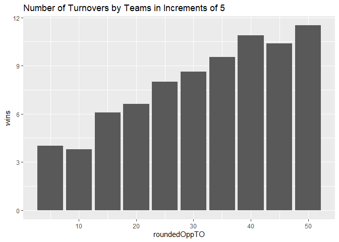
<center>
*Figure 12*
</center>

This will chart Penalties in intervals of 15, to see if this method is a
better predictor than the linear model.

``` r
rawDataTesting$roundedPenalties <- RoundTo(rawDataTesting$penalties, 15)

rawDataTesting %>%
  group_by(roundedPenalties) %>%
  summarize (wins = mean(wins)) %>%
  ggplot() + aes(x=roundedPenalties, y=wins) + geom_col() + ggtitle("Number of Penalties by Teams in Increments of 15")
```

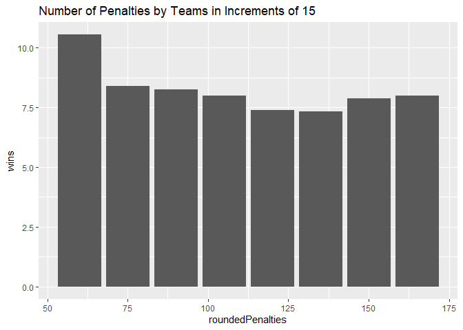
<center>
*Figure 13*
</center>

All variables look great to predict, except for penalties yet again. Now
I will run K Fold prediction models on these new variable sets to see if
it is a better predictor.

``` r
trainList <- createDataPartition(y=rawDataTesting$wins, p=0.66, list = FALSE)

# create train and test datasets 
trainData <- rawDataTesting[trainList,]
testData <- rawDataTesting[-trainList,]

# doing a 10 fold cross validation 3 times 
trctrl <- trainControl(method = "repeatedcv", number = 10, repeats = 3)

lm.model1 <- train(wins ~ roundedPenalties + roundedTO + roundedPPD + roundedOppTO, data = trainData, method = "lm",
                   trControl=trctrl)
summary(lm.model1)
```

    ## 
    ## Call:
    ## lm(formula = .outcome ~ ., data = dat)
    ## 
    ## Residuals:
    ##     Min      1Q  Median      3Q     Max 
    ## -5.9524 -1.4141 -0.0702  1.3822  5.7625 
    ## 
    ## Coefficients:
    ##                   Estimate Std. Error t value Pr(>|t|)    
    ## (Intercept)       0.489873   0.954851   0.513   0.6082    
    ## roundedPenalties -0.009062   0.005431  -1.669   0.0959 .  
    ## roundedTO        -0.096732   0.015268  -6.336 5.88e-10 ***
    ## roundedPPD        3.746654   0.247633  15.130  < 2e-16 ***
    ## roundedOppTO      0.164682   0.013305  12.378  < 2e-16 ***
    ## ---
    ## Signif. codes:  0 '***' 0.001 '**' 0.01 '*' 0.05 '.' 0.1 ' ' 1
    ## 
    ## Residual standard error: 1.965 on 438 degrees of freedom
    ## Multiple R-squared:  0.6135, Adjusted R-squared:   0.61 
    ## F-statistic: 173.8 on 4 and 438 DF,  p-value: < 2.2e-16

``` r
# Adjusted R score = 0.6003

predictValues <- predict(lm.model1, newdata = testData)
cor(predictValues, testData$wins)^2
```

    ## [1] 0.564537

The binning technique showed an R score of 0.6003, with the original
linear model showing an R Score of 0.6473. So the linear model would be
better used in predicting, so it is not worth binning the data to
predict wins.

## Method of Analysis - Decision Tree Building

For the playoffs question, I first assigned values to each team to
determine if they made the playoffs in the years that the data was
collected. Then I proceeded to run a decision tree analysis with K-Fold
interpretation to acquire a model with 71.28% total accuracy.

First I needed to manually add if a team made it to the playoffs in each
specific year. Then I added that onto the data testing dataframe, making
the playoff prediction a factor.

``` r
dataTestingT <- read_csv("dataTesting.csv")
```

    ## Rows: 669 Columns: 13
    ## -- Column specification --------------------------------------------------------
    ## Delimiter: ","
    ## chr  (2): teamName, playoffs
    ## dbl (11): ID, year, avgPPD, oppTO, penalties, TO, wins, roundedTO, roundedPP...
    ## 
    ## i Use `spec()` to retrieve the full column specification for this data.
    ## i Specify the column types or set `show_col_types = FALSE` to quiet this message.

``` r
dataTestingT <- select(dataTestingT, -"ID")
dataTestingT$playoffs <- as.factor(dataTestingT$playoffs)
```

First I will be running a SVM model to get an idea of the predictive
model, then run a confusion matrix to test accuracy.

``` r
trainList <- createDataPartition(y=dataTestingT$playoffs, p=0.50, list = FALSE)

# create train and test datasets 
trainData <- dataTestingT[trainList,]
testData <- dataTestingT[-trainList,]

svm.model <-train(playoffs ~ avgPPD + oppTO + penalties + TO + roundedPenalties
                  + roundedOppTO + roundedPPD + roundedTO, data = trainData,
                  method = "svmRadial",
                  trControl=trainControl(method = "none"),
                  preProcess = c("center","scale"))
svm.model
```

    ## Support Vector Machines with Radial Basis Function Kernel 
    ## 
    ## 335 samples
    ##   8 predictor
    ##   2 classes: 'NO', 'YES' 
    ## 
    ## Pre-processing: centered (8), scaled (8) 
    ## Resampling: None

``` r
predictValues <- predict(svm.model, newdata = testData) 
confusionMatrix(predictValues, testData$playoffs)
```

    ## Confusion Matrix and Statistics
    ## 
    ##           Reference
    ## Prediction  NO YES
    ##        NO  189  49
    ##        YES  19  77
    ##                                           
    ##                Accuracy : 0.7964          
    ##                  95% CI : (0.7492, 0.8383)
    ##     No Information Rate : 0.6228          
    ##     P-Value [Acc > NIR] : 5.853e-12       
    ##                                           
    ##                   Kappa : 0.5454          
    ##                                           
    ##  Mcnemar's Test P-Value : 0.0004368       
    ##                                           
    ##             Sensitivity : 0.9087          
    ##             Specificity : 0.6111          
    ##          Pos Pred Value : 0.7941          
    ##          Neg Pred Value : 0.8021          
    ##              Prevalence : 0.6228          
    ##          Detection Rate : 0.5659          
    ##    Detection Prevalence : 0.7126          
    ##       Balanced Accuracy : 0.7599          
    ##                                           
    ##        'Positive' Class : NO              
    ## 

This had a total of 78.74% accuracy. Now I will run a K Fold evaluation
model to see if we can increase the accuracy of the predictive model.

``` r
trctrl <- trainControl(method = "repeatedcv", number = 10)
svm.model.kfold <- train(playoffs~avgPPD + oppTO + penalties + TO + roundedPenalties
                         + roundedOppTO + roundedPPD + roundedTO,
                         data = trainData,
                         method = "svmRadial",
                         trainControl=trctrl,
                         preProcess = c("center","scale"))
svm.model.kfold
```

    ## Support Vector Machines with Radial Basis Function Kernel 
    ## 
    ## 335 samples
    ##   8 predictor
    ##   2 classes: 'NO', 'YES' 
    ## 
    ## Pre-processing: centered (8), scaled (8) 
    ## Resampling: Bootstrapped (25 reps) 
    ## Summary of sample sizes: 335, 335, 335, 335, 335, 335, ... 
    ## Resampling results across tuning parameters:
    ## 
    ##   C     Accuracy   Kappa    
    ##   0.25  0.7530022  0.4630450
    ##   0.50  0.7549419  0.4709180
    ##   1.00  0.7466882  0.4555995
    ## 
    ## Tuning parameter 'sigma' was held constant at a value of 0.1312242
    ## Accuracy was used to select the optimal model using the largest value.
    ## The final values used for the model were sigma = 0.1312242 and C = 0.5.

``` r
predictValues <- predict(svm.model.kfold, newdata = testData) 
confusionMatrix(predictValues, testData$playoffs)
```

    ## Confusion Matrix and Statistics
    ## 
    ##           Reference
    ## Prediction  NO YES
    ##        NO  189  47
    ##        YES  19  79
    ##                                           
    ##                Accuracy : 0.8024          
    ##                  95% CI : (0.7556, 0.8437)
    ##     No Information Rate : 0.6228          
    ##     P-Value [Acc > NIR] : 9.901e-13       
    ##                                           
    ##                   Kappa : 0.5602          
    ##                                           
    ##  Mcnemar's Test P-Value : 0.000889        
    ##                                           
    ##             Sensitivity : 0.9087          
    ##             Specificity : 0.6270          
    ##          Pos Pred Value : 0.8008          
    ##          Neg Pred Value : 0.8061          
    ##              Prevalence : 0.6228          
    ##          Detection Rate : 0.5659          
    ##    Detection Prevalence : 0.7066          
    ##       Balanced Accuracy : 0.7678          
    ##                                           
    ##        'Positive' Class : NO              
    ## 

The K fold had similar accuracy, so it is not worth complicating the
model for similar accuracy. Now I will run a supervised learning model
producing a decision tree.

``` r
trctrl <- trainControl(method = "cv", number = 10)

model.rpart <- train(playoffs~avgPPD + oppTO + penalties + TO, 
                     method = "rpart",
                     trControl = trctrl,
                     data = trainData,
                     tuneLength = 3)
model.rpart
```

    ## CART 
    ## 
    ## 335 samples
    ##   4 predictor
    ##   2 classes: 'NO', 'YES' 
    ## 
    ## No pre-processing
    ## Resampling: Cross-Validated (10 fold) 
    ## Summary of sample sizes: 301, 302, 301, 301, 303, 301, ... 
    ## Resampling results across tuning parameters:
    ## 
    ##   cp          Accuracy   Kappa    
    ##   0.02777778  0.7136754  0.3719695
    ##   0.15079365  0.6954824  0.3729565
    ##   0.23015873  0.6450368  0.1915070
    ## 
    ## Accuracy was used to select the optimal model using the largest value.
    ## The final value used for the model was cp = 0.02777778.

``` r
varImp(model.rpart)
```

    ## rpart variable importance
    ## 
    ##           Overall
    ## avgPPD     100.00
    ## TO          63.34
    ## oppTO       58.31
    ## penalties    0.00

``` r
predictValues <- predict(model.rpart,newdata = testData)
confusionMatrix(predictValues, testData$playoffs)
```

    ## Confusion Matrix and Statistics
    ## 
    ##           Reference
    ## Prediction  NO YES
    ##        NO  170  52
    ##        YES  38  74
    ##                                           
    ##                Accuracy : 0.7305          
    ##                  95% CI : (0.6795, 0.7774)
    ##     No Information Rate : 0.6228          
    ##     P-Value [Acc > NIR] : 2.083e-05       
    ##                                           
    ##                   Kappa : 0.4137          
    ##                                           
    ##  Mcnemar's Test P-Value : 0.1706          
    ##                                           
    ##             Sensitivity : 0.8173          
    ##             Specificity : 0.5873          
    ##          Pos Pred Value : 0.7658          
    ##          Neg Pred Value : 0.6607          
    ##              Prevalence : 0.6228          
    ##          Detection Rate : 0.5090          
    ##    Detection Prevalence : 0.6647          
    ##       Balanced Accuracy : 0.7023          
    ##                                           
    ##        'Positive' Class : NO              
    ## 

``` r
rpart.plot(model.rpart$finalModel)
```

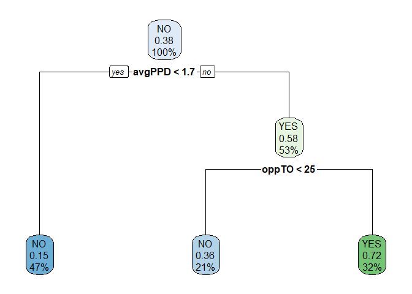
<center>
*Figure 14*
</center>

With a 71.26% accurate model, we find that Average points per drive and
forcing turnovers were the most important variables.

Now lets see if the decision tree has a higher accuracy with the binned
variables previously created:

``` r
model.rpart <- train(playoffs~roundedTO + roundedOppTO + roundedPenalties + roundedTO, method = "rpart",
                     data = trainData, 
                     trControl=trctrl,
                     tuneLength = 3)
model.rpart
```

    ## CART 
    ## 
    ## 335 samples
    ##   3 predictor
    ##   2 classes: 'NO', 'YES' 
    ## 
    ## No pre-processing
    ## Resampling: Cross-Validated (10 fold) 
    ## Summary of sample sizes: 301, 301, 302, 302, 301, 303, ... 
    ## Resampling results across tuning parameters:
    ## 
    ##   cp          Accuracy   Kappa    
    ##   0.04761905  0.7135027  0.3302618
    ##   0.08730159  0.6723262  0.2546854
    ##   0.18253968  0.6327317  0.1037019
    ## 
    ## Accuracy was used to select the optimal model using the largest value.
    ## The final value used for the model was cp = 0.04761905.

``` r
predictValues <- predict(model.rpart,newdata = testData)
confusionMatrix(predictValues, testData$playoffs)
```

    ## Confusion Matrix and Statistics
    ## 
    ##           Reference
    ## Prediction  NO YES
    ##        NO  192  72
    ##        YES  16  54
    ##                                          
    ##                Accuracy : 0.7365         
    ##                  95% CI : (0.6858, 0.783)
    ##     No Information Rate : 0.6228         
    ##     P-Value [Acc > NIR] : 7.235e-06      
    ##                                          
    ##                   Kappa : 0.3854         
    ##                                          
    ##  Mcnemar's Test P-Value : 4.545e-09      
    ##                                          
    ##             Sensitivity : 0.9231         
    ##             Specificity : 0.4286         
    ##          Pos Pred Value : 0.7273         
    ##          Neg Pred Value : 0.7714         
    ##              Prevalence : 0.6228         
    ##          Detection Rate : 0.5749         
    ##    Detection Prevalence : 0.7904         
    ##       Balanced Accuracy : 0.6758         
    ##                                          
    ##        'Positive' Class : NO             
    ## 

With a 70% Accuracy this model is not with the binned variables again.

## Conclusion

The results of the study were relatively the same as the previous
thoughts and teachings of my past coaches. There were trends that
penalties affected the win rate of teams, as shown in the summary graph
of figure 3, yet that statistic was not significant in the linear
regression model or the decision tree. There were not only trends in the
turn over rates of teams affecting the total wins in a season as shown
in figure 2, but showed a significant correlation in the linear
regression model. The forced turnovers had a greater impact on the wins
during the course of a season, showing not only a better correlation
than turnovers, but a larger coefficient meaning that forced turnovers
had a greater affect than turnovers on a team’s success in figure 9.
Finally, the average points per drive had the greatest amount of
significance when predicting wins, not only in the summary data, but
also the linear regression model and the decision tree shown in figure
10.

What I found the most interesting in this study was the difference of
importance between turn overs and forced turnovers. Forced turnovers not
only having a higher correlation score, but also having a larger
coefficient to predict the number of wins. This could have huge
implications in coaching, by stressing the importance of bouncing back
from turning the ball over. Often, teams struggle to regain momentum
after a they have turned the ball over, when in reality the more
important thing that could determine if they win or lose the game is if
their defense can force a turnover to answer. Too many times we see the
effort of a team deflate after a turnover, when really it should be the
opposite to regain possession of the ball and into their offenses’
hands.

That leads to my next surprise thought was that penalties were not
significant in either the linear model or the decision tree model. It
looked good in the summary statistics in figure 3, but penalties do
range in severity so I could see how getting a lot of small penalties
won’t make you lose a game like a few bigger penalties would. Average
points per drive is a statistic that has gained traction in the last
four years and for good reason. Being able to assign an offensive
efficiency score to a team that has such a strong prediction power of
winning or losing games could be huge in predictive analytics as shown
in figure 8. Further studies I would be interested in doing is looking
at a turnover margin. Teams that might have forced more turnovers than
lost turn overs, and how that marginal number can affect the win rate of
teams in this twenty-year span. I would also hold interest in looking at
similar data for college football instead of the NFL, to see the
differences between the two.
